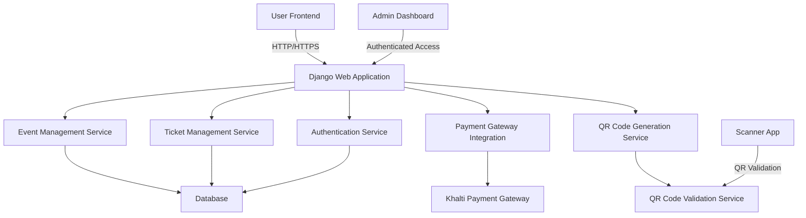
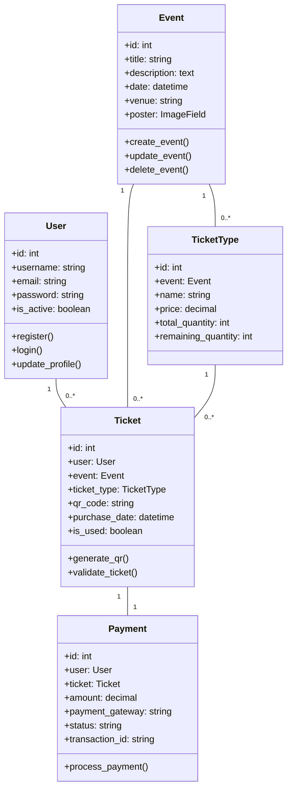
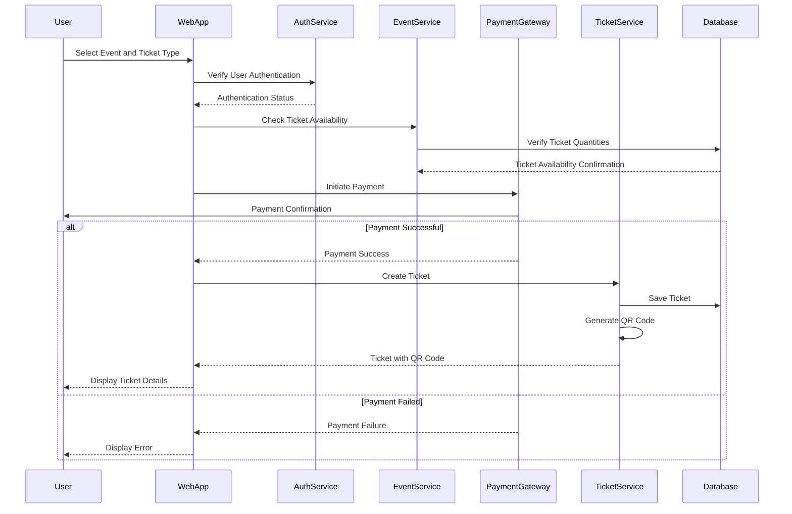
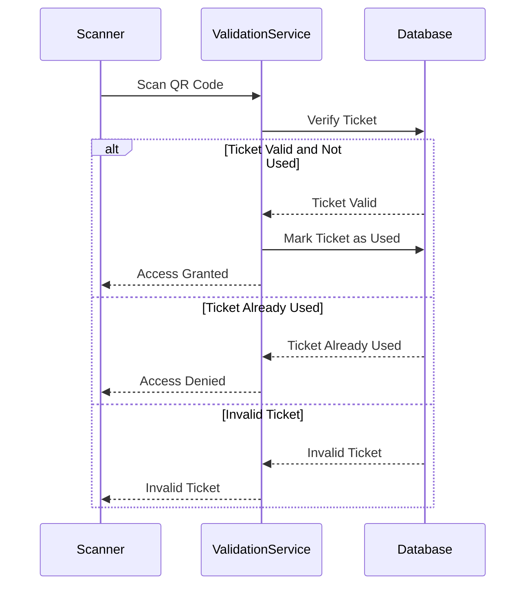

I'll help you design a comprehensive system architecture for your movie/event ticketing SaaS application using PlantUML. I'll break this down into multiple diagrams to cover different aspects of the system.


Let's start with the overall system architecture and class diagrams:



Now, let's create a class diagram to represent the core entities:



Next, let's create a sequence diagram for ticket purchasing:



Let's create a sequence diagram for QR ticket validation:



Finally, a deployment diagram to show the system components:

```mermaid
deployment {
    node "Web Server" {
        artifact "Django Web Application" as DjangoApp
        artifact "Gunicorn/WSGI" as WSGI
    }
    
    node "Database Server" {
        artifact "PostgreSQL Database" as DB
    }
    
    node "Cache Server" {
        artifact "Redis" as Cache
    }
    
    node "Payment Gateway" {
        artifact "Khalti Payment API" as PaymentGW
    }
    
    node "QR Validation Server" {
        artifact "QR Validation Service" as QRService
    }
    
    DjangoApp --> DB : Database Connection
    DjangoApp --> Cache : Caching
    DjangoApp --> PaymentGW : Payment Processing
    DjangoApp --> QRService : Ticket Validation
}

```

Key Architecture Considerations:
1. **Authentication**: 
   - Use Django's built-in authentication system
   - Implement JWT or session-based authentication
   - Add role-based access control (admin vs. regular user)

2. **Payment Integration**:
   - Integrate Khalti Payment Gateway
   - Implement secure payment processing
   - Handle payment failures and success scenarios

3. **Ticket Management**:
   - Generate unique QR codes for each ticket
   - Implement ticket validation mechanism
   - Track ticket usage status

4. **Event and Ticket Flexibility**:
   - Support multiple ticket types (VIP, Normal, etc.)
   - Dynamic event creation with flexible pricing

5. **Performance Considerations**:
   - Use Redis for caching
   - Implement database indexing
   - Use async tasks for background processing

Recommended Technologies:
- Django Framework
- PostgreSQL Database
- Django Rest Framework (for API)
- Celery for background tasks
- Django Simple History for tracking changes
- Django Admin for admin panel
- Pillow for image handling
- Django-qr-code for QR generation
- Python-Khalti for payment integration

Next Steps:
1. Set up Django project structure
2. Define models based on the class diagram
3. Implement authentication
4. Create views and serializers
5. Integrate Khalti Payment Gateway
6. Develop QR code generation and validation
7. Build admin interfaces
8. Implement frontend ( using Django template)
